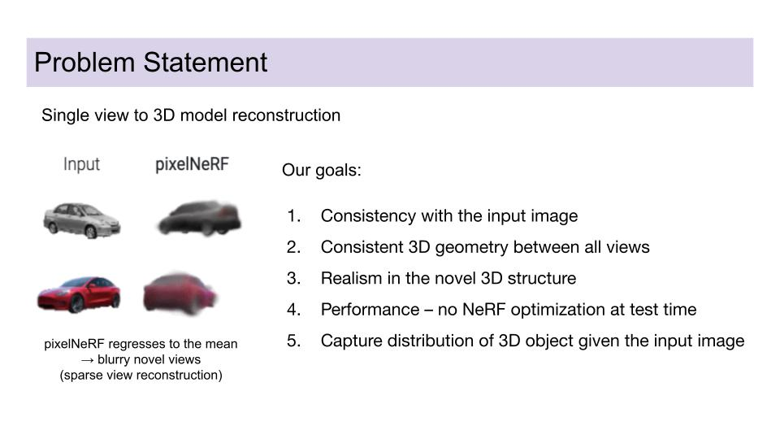

# Pi-xel-GANeRF: 3D-Consistent Probability Distribution Modeling for Novel View Synthesis

Project code for 16-825 at Carnegie Mellon University created with https://github.com/TobxD and https://github.com/ShreyaSharma99.

We combine [pi-GAN](https://github.com/marcoamonteiro/pi-GAN) with [pixel-nerf](https://github.com/sxyu/pixel-nerf) to generate a probability distribution over 3D-consistent novel views of a scene given sparse input views.

.jpg)
.jpg)
.jpg)
.jpg)
.jpg)